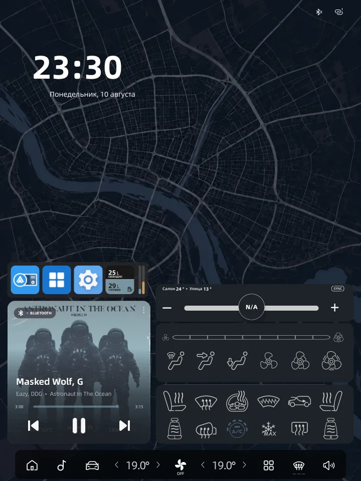
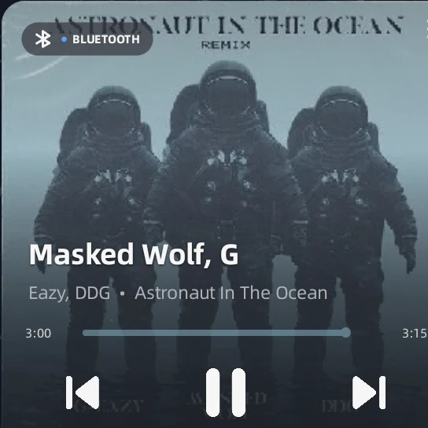
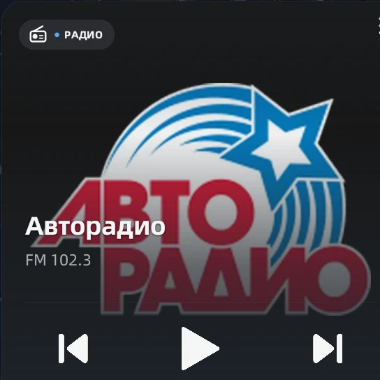
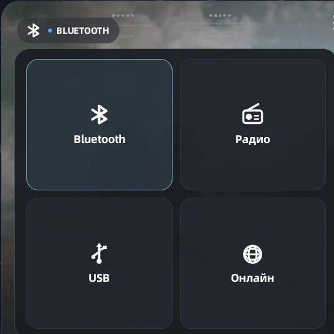
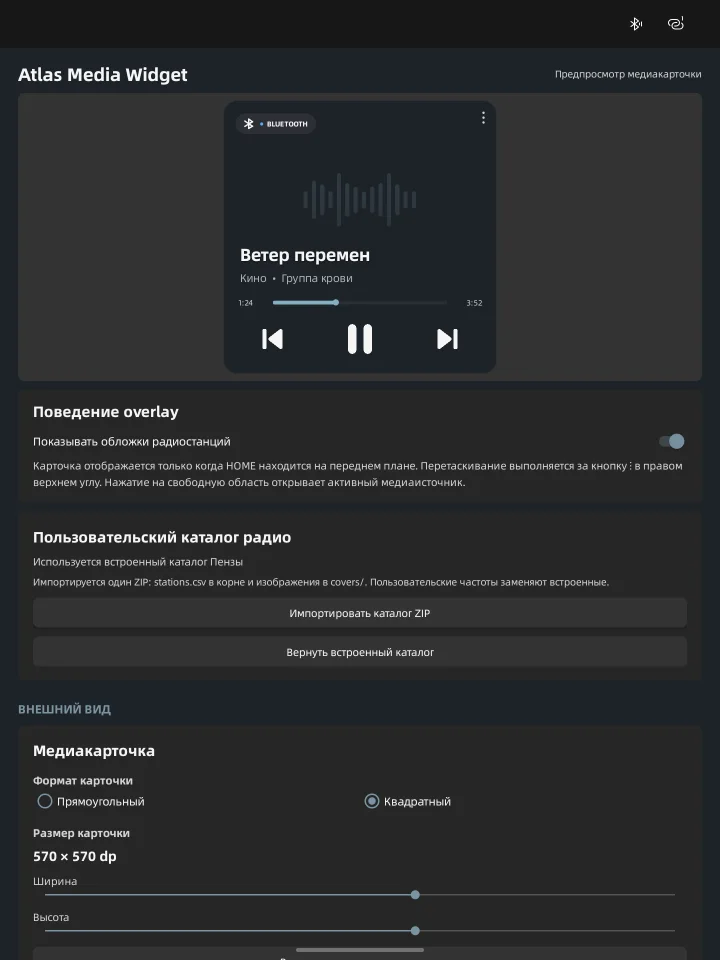

<p align="center">
  
</p>

# Atlas Media Widget

A media card with Overlay and Android Widget modes for portrait Geely OneOS automotive head units running Android 11.
[Русская версия](README.md)

Atlas Media Widget shows artwork, metadata, playback progress, transport controls and available
audio sources on the home screen. State and commands use the private Media Bridge protocol v1.

**Overlay** uses `TYPE_APPLICATION_OVERLAY` and appears only over HOME. **Widget** is a system
Android AppWidget, sized and placed by the launcher. Existing installations default to Overlay.
Appearance is shared across instances; switching modes preserves the overlay geometry.

Add the widget from HOME’s widget picker or with **Add widget** on the Card tab. Placing it from
HOME opens a short dialog over the screen with a preview, layout, artwork dimming and **Add**.
✕, Back or a tap outside cancels placement and restores the previous appearance. When Overlay is
selected, the dialog offers to switch to Widget mode; without it, placed widgets stay inactive.
On Android 11 the launcher must explicitly support reconfiguration; widgetFeatures alone is insufficient.

## Current architecture

Only the integrated Widget APK is supported. It contains:

- the overlay and AppWidget application in `:app`;
- the embedded media runtime in `:media-runtime`;
- the private `:media` process with the Media Bridge, media sessions and diagnostics;
- OneOS and ECarX adapters, shared models and tests in `:media-core`, `:vendor-oneos` and
  `:vendor-ecarx-stub`.

A separate Atlas Media API APK is neither built nor required. Media diagnostics are opened from the
Widget application; its standalone launcher is removed from the integrated variant.

## Interface

The card occupies only its configured area over the stock HOME screen. It can be moved and
configured by size and appearance; tapping its free area opens the active source. Settings include
a preview using the same rendering path as the selected mode. AppWidget previews use the selected
instance’s size; before placement a labeled sample size with demo media is shown. Progress on HOME
updates every second. Tapping the progress bar seeks to that point directly; tapping the time
shows a draggable bar over the widget's own bar for precise seeking. Source selection stays inside
the AppWidget, while favorites open the existing media card controls.

<p align="center">
  <a href="docs/images/home-overview.webp">
    
  </a>
</p>

<table>
  <tr>
    <th>Bluetooth</th>
    <th>Radio</th>
    <th>Sources</th>
  </tr>
  <tr>
    <td>
      <a href="docs/images/media-bluetooth-device.webp">
        
      </a>
    </td>
    <td>
      <a href="docs/images/media-radio-device.webp">
        
      </a>
    </td>
    <td>
      <a href="docs/images/media-sources-device.webp">
        
      </a>
    </td>
  </tr>
</table>

<p align="center">
  <a href="docs/images/settings-device.webp">
    
  </a>
</p>

## Features

- Bluetooth, radio, USB, Online and CarPlay/Android Auto sources;
- artwork, metadata, progress and capability-aware transport controls;
- local progress interpolation without per-second IPC polling;
- configurable card size, position, artwork dimming, typography, spacing and control panel;
- HOME-only visibility, drag handle and configurable hiding threshold;
- one settings screen with four tabs: Card, Media, Radio and System; text, spacing and control
  panel fine-tuning is collapsed by default;
- default source, startup delay, autoplay and source-loss behavior controls;
- Online player selection, optional switch to Online before session playback and player minimization;
- radio catalog with station artwork, favorites grid and saved-station navigation without scanning;
- radio title and artwork broadcast to the Geely OneOS DIM; optional separate Online progress
  updates;
- shortcuts to the active media app or stock Radio, Bluetooth and USB screens;
- ZIP settings backup/restore, legacy JSON import and separate radio-catalog transfer
  (`stations.csv` and `covers/`);
- two-phase settings import with a crash-recovery journal;
- foreground service, boot start and bounded IPC reconnection backoff;
- explicit connected/disconnected and unavailable states instead of indefinite stale data;
- media-service and OneOS integration diagnostics.

## Requirements and permissions

- Android 11 or newer; `minSdk 30`, `compileSdk` and `targetSdk` 36;
- portrait automotive display, with 1440×1920 as the target configuration;
- JDK 17 for builds;
- Display over other apps (Overlay mode only);
- Usage Access and the accessibility service to determine HOME visibility (Overlay mode only);
- Notification Access to observe Android media sessions;
- storage access for USB artwork and radio-catalog imports.

The app cannot grant these permissions to itself. Boot start and background execution also depend
on the OneOS firmware and its power-management settings.

## Installation and quick start

1. Build or install the only supported integrated APK.
2. Open **Atlas Media Widget** and select the display mode on the **Card** tab.
3. On the **Media** tab, check the media service, access, default source and startup behavior.
4. On the **Card** tab, configure appearance. Overlay also provides permissions, manual size and
   position there. Station navigation and the catalog live on the **Radio** tab.
5. For Overlay, tap **Start** and enable launch on boot if required. For Widget, add an instance to HOME; the media service runs independently of the settings window.

## Build and checks

Use the repository Gradle Wrapper:

```sh
sh gradlew --offline clean check assembleRelease
```

The application-only release task is:

```sh
sh gradlew :app:assembleRelease
```

The integrated release APK is written to:

```text
app/build/outputs/apk/integrated/release/<effectiveVersionName>[<versionCode>]AtlasMediaWidget-release.apk
```

Base `appVersionName` and `appVersionCode` live at the top of `app/build.gradle`. `main` keeps the
base version name; other branches append a sanitized branch suffix. Signing is supplied by the
ignored local `secure.signing.gradle` when available, so an unsigned APK must not be treated as a
production release.

## Documentation

- [Media Bridge protocol v1](docs/full-media-bridge.md) — IPC contract, models and commands;
- [Radio catalog](docs/radio-catalog.md) — CSV/ZIP format and station artwork;
- [Architecture options](docs/architecture-options.md) — rationale for the integrated runtime;
- [GInputBridge compatibility](docs/ginputbridge-api.md) — archived legacy protocol reference.

## Compatibility

The primary target is a portrait Geely OneOS head unit on Android 11. OEM Binder behavior, boot
startup, media sessions, dashboard output and power management vary by firmware. A successful build
and unit tests do not replace testing on the real head unit, especially for source switching,
cold-boot startup and sleep/wake recovery.
