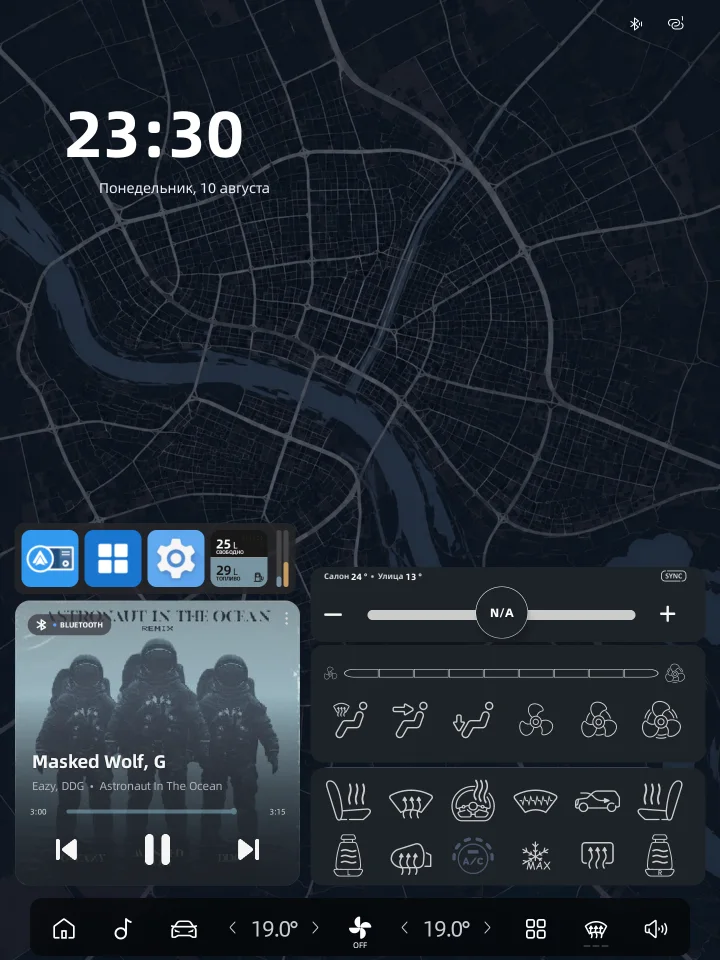
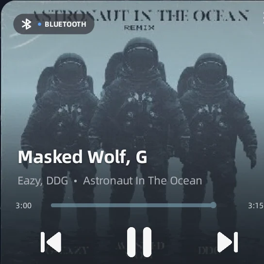
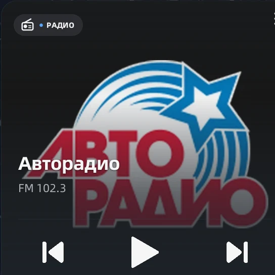
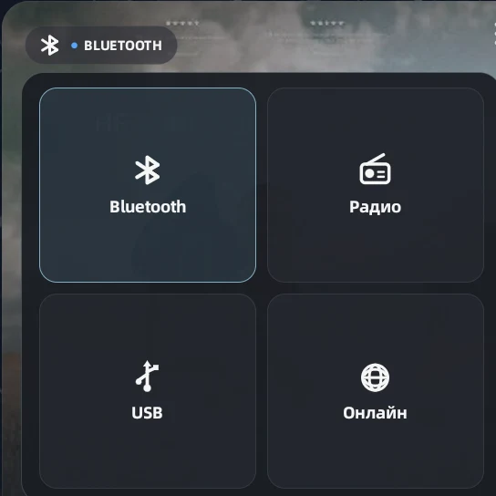
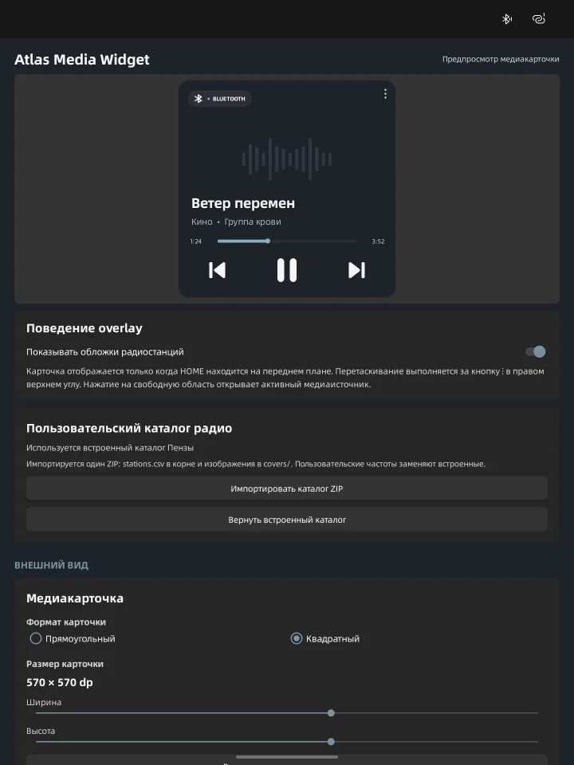

<p align="center">
  
</p>

<h1 align="center">Atlas Media Widget</h1>

<p align="center">
  Медиакарточка-оверлей для портретных автомобильных ГУ на Android 11
</p>

Atlas Media Widget показывает на домашнем экране обложку, метаданные, прогресс воспроизведения,
кнопки управления и переключатель источников. Состояние и команды передаются через Media Bridge
`mediaapi v1` установленного приложения GInputBridge.

> Atlas Media Widget использует `TYPE_APPLICATION_OVERLAY`, а не системный `AppWidget`. Карточка
> отображается только поверх HOME и не блокирует управление остальной частью экрана.

## Интерфейс

Карточка работает поверх штатного домашнего экрана и занимает только выделенную ей область.
Остальные элементы HOME остаются видимыми и интерактивными.

<p align="center">
  <a href="docs/images/home-overview.webp">
    
  </a>
</p>

<table>
  <tr>
    <th>Bluetooth</th>
    <th>Радио</th>
    <th>Источники</th>
  </tr>
  <tr>
    <td>
      <a href="docs/images/media-bluetooth-device.webp">
        
      </a>
    </td>
    <td>
      <a href="docs/images/media-radio-device.webp">
        
      </a>
    </td>
    <td>
      <a href="docs/images/media-sources-device.webp">
        
      </a>
    </td>
  </tr>
</table>

В приложении есть живой предпросмотр и отдельные настройки размера, формата и внешнего вида
карточки.

<p align="center">
  <a href="docs/images/settings-device.webp">
    
  </a>
</p>

## Возможности

- источники Bluetooth, Radio, USB и Online;
- полноразмерная обложка с градиентом для читаемости текста;
- play/pause, previous, next и seek с учётом доступных источнику действий;
- локальное плавное обновление прогресса без ежесекундных Binder-запросов;
- прямоугольный формат 500×300 и квадратный формат 500×500;
- отдельная настройка размера, текста, отступов, прогресса и панели управления для каждого формата;
- живой предпросмотр, использующий тот же `MediaCardView`, что и overlay;
- встроенный каталог 25 FM-станций Пензы с обложками;
- импорт собственного ZIP-каталога радио с CSV и изображениями;
- открытие активного медиаприложения или штатного экрана Radio, Bluetooth и USB;
- отображение только поверх HOME, перетаскивание карточки и сохранение позиции;
- импорт и экспорт переносимых настроек в версионированный JSON;
- foreground service, автозапуск после загрузки ГУ и восстановление соединения с GInputBridge;
- явное состояние недоступного медиасервиса вместо бессрочного показа устаревших данных.

## Требования

- Android 11;
- портретный экран; целевая конфигурация — 1440×1920;
- GInputBridge 4.4.7 или новее с поддержкой Media Bridge `mediaapi v1`;
- разрешения «Поверх других приложений», «Доступ к истории использования» и «Контроль окон»
  (сервис специальных возможностей) для Atlas Media Widget;
- для надёжного автозапуска — разрешение автозапуска и снятие ограничений фоновой работы прошивки ГУ.

В GInputBridge должны быть включены:

- Media runtime;
- External API / Media Bridge runtime;
- доступ к уведомлениям для MediaSession-плееров;
- `Управлять радио и Bluetooth` для команд штатным Radio и Bluetooth.

## Установка и запуск

1. Установите и настройте совместимую версию GInputBridge.
2. Установите APK Atlas Media Widget.
3. Откройте приложение и выдайте разрешения поверх окон, на историю использования и на контроль окон.
4. Проверьте статус GInputBridge на экране настроек.
5. Выберите формат и размер карточки.
6. Нажмите `Запустить`.
7. При необходимости включите автозапуск после загрузки ГУ.

Карточка появляется на домашнем экране. Для перемещения используйте кнопку `⋮` в правом верхнем
углу. Нажатие на свободную область карточки открывает текущий медиаисточник.

## Каталог радио

Приложение содержит каталог FM-станций Пензы. Пользовательский каталог импортируется одним ZIP-файлом
и может заменять названия и обложки для выбранных частот.

Формат архива и пример CSV описаны в [документации каталога](docs/radio-catalog.md).

## Перенос настроек

На экране настроек в разделе «Система» можно экспортировать конфигурацию в JSON и импортировать её
на этой или другой ГУ. Экспорт сохраняется прямо в папку «Загрузки» и не требует системного выбора
файлов. Файл содержит внешний вид обоих форматов карточки, положение overlay,
масштаб интерфейса, автозапуск и настройку радиообложек. Системные разрешения, текущее состояние
сервиса и пользовательский каталог радио в резервную копию не входят.

## Сборка

Требуются JDK 17 и Android SDK 36. Сборка выполняется репозиторным Gradle Wrapper:

```sh
ANDROID_HOME=/path/to/android-sdk sh gradlew --offline clean check assembleRelease
```

Release APK создаётся в `app/build/outputs/apk/release/` с именем вида
`<versionName>[<versionCode>]AtlasMediaWidget-release.apk`.

Локальная release-подпись подключается через игнорируемый `secure.signing.gradle`. Без него Gradle
создаёт unsigned release APK.

## Документация

- [Контракт Media Bridge](docs/full-media-bridge.md)
- [Совместимость с legacy API GInputBridge](docs/ginputbridge-api.md)
- [Архитектурные варианты и ограничения](docs/architecture-options.md)
- [Формат пользовательского каталога радио](docs/radio-catalog.md)

## Совместимость

Основная целевая платформа — протестированная портретная ГУ на Android 11. Поведение OEM-компонентов,
автозапуска и энергосбережения может отличаться между версиями прошивки и требует проверки на
реальном устройстве.
