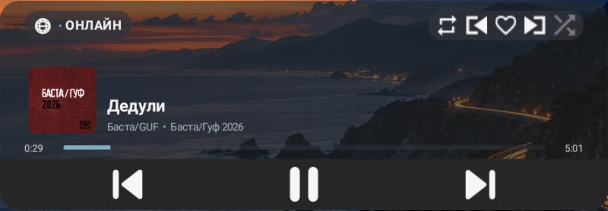
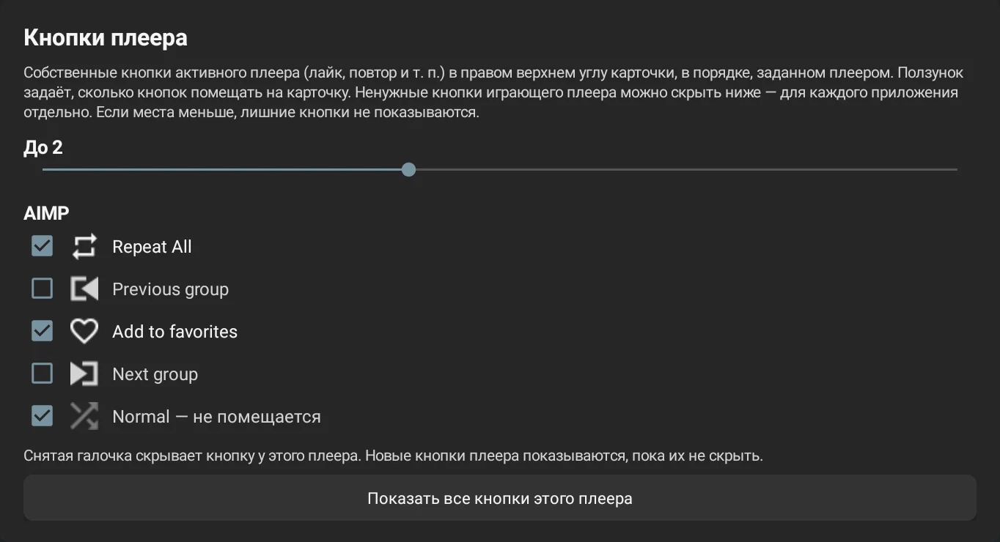
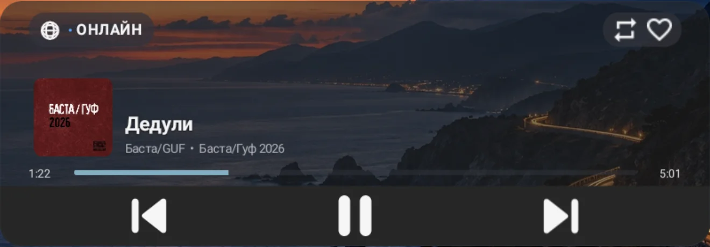

# Player buttons

Besides the usual previous / pause / next, many Android players publish their own buttons in their
media session: like, repeat, shuffle, playlist navigation and so on. Atlas Media Widget shows these
buttons on the card, both in the overlay and in the system widget.

The buttons use the player's own icons and behave as in the player's notification: the widget does
not know what each button does and simply passes the tap to the player. No per-app support is
needed; the player only has to publish such buttons.

> Screenshots were taken on an Android 11 emulator (1440×1920) with AIMP. The Russian screenshots
> show the Russian UI; labels are translated below.

## Where they appear

The buttons share one pill in the top-right corner of the card, opposite the source pill. By
default they keep the player's order, which can be changed in the settings.

  

After a tap the player changes the icon itself and the card shows the new state: for example, the
outlined heart becomes filled once the track is added to favorites.

There are no buttons:

- for radio, where the slot holds «Избранное» (Favorites);
- for stock OneOS sources: USB, Bluetooth and CarPlay do not publish them;
- for players that add a like button only to their notification, not to the media session.

## Settings

Open **Atlas Media Widget → «Карточка» (Card) → «Кнопки плеера» (Player buttons)**. Start
playback in the player you want to configure: the list always shows the player that is playing now.

  

### How many buttons

The **«До N»** (Up to N) slider sets how many buttons fit on the card: 0 to 5, 2 by default. 0
hides the pill. The slider applies to every player.

The card shows the first N visible buttons in the list order. A visible button beyond the limit
is marked **«— не помещается»** (does not fit) in the list. A narrow card or a large top-row font can
fit fewer buttons than requested; the pill never covers the source pill.

### Which buttons to show and in what order

Below the slider are the playing player's name and all of its buttons with icons, in the order
they will appear on the card:

- **checked**: the button is shown;
- **unchecked**: the button is hidden for this player;
- **▲ ▼ arrows** on the right move the button up or down. The top button of the list comes first
  on the card, that is, leftmost.

Hiding and order are remembered per app: hiding repeat for AIMP does not affect Yandex Music. New
buttons a player adds after an update appear right away at the end of the list and can be moved or
hidden the same way.

Some players replace a button after a tap (for example, «like» with «remove like»). When the new
button takes the place of the vanished one, the widget treats it as the same button: it keeps its
place in the order and stays hidden if it was hidden.

**«Сбросить кнопки этого плеера»** (Reset this player's buttons) restores the player's order and
shows all of its buttons.

### Result

In the example above, AIMP's favorites button is moved to the top, the group buttons are hidden and
the limit is 2. The card keeps favorites and repeat, while shuffle does not fit:

  

To keep only the like button, set the limit to 1 or uncheck every other button.

## Player examples

What the players tested on the emulator publish:

| Player | Buttons in order |
|---|---|
| AIMP | Repeat All, Previous group, Add to favorites (like), Next group, Normal (shuffle) |
| Yandex Music | Dislike, Like |

Button names come from the player and often include the state (for example, «Like Not selected»).

The full list of any player's buttons with their ids is in the diagnostics:
**«Система» (System) → «Открыть диагностику OneOS» → «Запустить проверку OneOS»**, section
«Active Media Sessions».

## Troubleshooting

- **No buttons at all.** Check that the slider is not at 0 and the source is Online, then check in
  the diagnostics whether the player publishes buttons. If the list is empty, the player does not.
- **A button is missing from the card.** It is either hidden (unchecked) or beyond the limit; the
  settings list shows which. Move it up, raise the limit or hide the unwanted buttons before it.
- **A button moved or reappeared after a tap.** The player replaced it with a button that has a
  different id in a different position. Move or hide it again; the setting then applies to the new
  button.

Player button settings are part of the settings backup (System tab).
